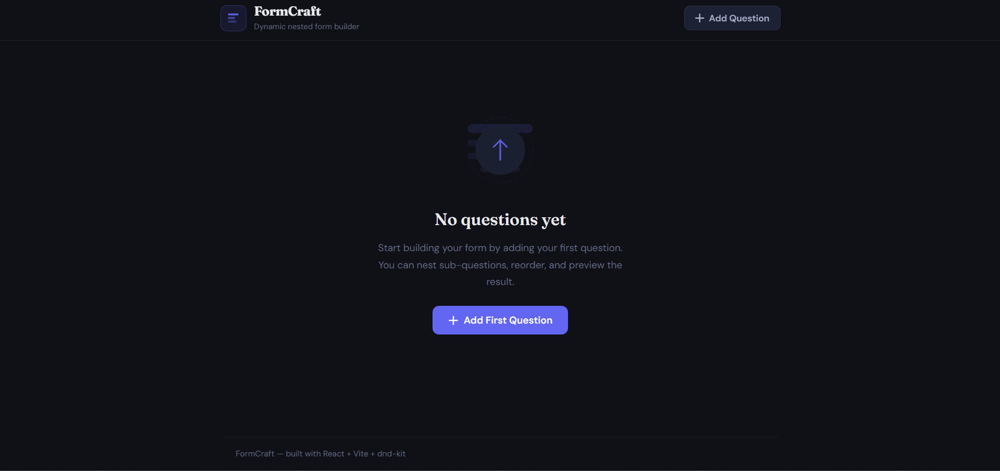
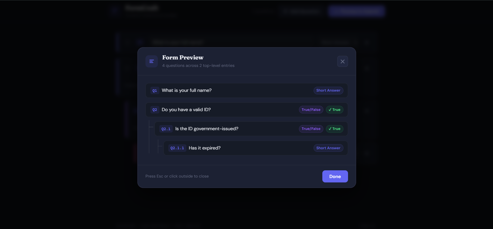

# FormCraft — Dynamic Nested Form Builder

A production-grade React application for building dynamic, infinitely-nested forms with drag-and-drop reordering, local storage persistence, and a premium dark-mode UI.

---

## Tech Stack

| Technology | Reason |
|---|---|
| **Vite** | Lightning-fast dev server + HMR; smaller build output vs CRA |
| **React 19 + TypeScript** | Type-safe component props and reducer actions prevent runtime bugs |
| **useReducer + Context** | Centralised, predictable state machine for complex nested mutations |
| **@dnd-kit** | Lightweight, accessible drag-and-drop; no jQuery dependency |
| **CSS Modules** | Scoped styles with zero runtime overhead; full design control |
| **Google Fonts (DM Sans + Fraunces)** | Premium typographic pairing: geometric sans for UI, optical serif for headings |

---

## Setup

```bash
npm install
npm run dev       # http://localhost:5173
npm run build     # production build → dist/
npm run preview   # preview production build locally
```

---

## Features

### Core
- **Dynamic question builder** — "Add Question" button appends new questions at the top level
- **Two question types** — *Short Answer* and *True/False*
- **Conditional sub-questions** — When a True/False question is answered "True", an "Add Sub-question" button appears; sub-questions nest infinitely
- **Auto-numbering** — Hierarchical numbers (Q1, Q1.1, Q1.1.1, Q2…) recalculate live on every add, delete, and reorder
- **Delete with cascade** — Deleting a parent removes all descendants
- **Collapse/expand children** — Toggle child visibility per card
- **Form preview modal** — "Preview & Submit" shows a full tree-view with connecting lines, type badges, and answer badges

### Bonus
- **Local storage persistence** — State auto-saves on every keystroke; restored on reload with a dismissible banner
- **Clear saved data** — One-click wipe from the banner or footer
- **Drag-and-drop reordering** — Top-level questions have a grip handle; drag to reorder, numbers update instantly
- **Keyboard DnD** — Full keyboard navigation for accessibility

---

## Design Decisions

### State Architecture — `useReducer` over `useState`
Form state involves complex nested mutations (add child, delete subtree, update field, reorder). A single reducer with typed action discriminants makes every transition explicit and testable. Context wraps the reducer so any component can dispatch without prop drilling.

### Recursive Rendering
`QuestionCard` renders itself recursively for children. Each level passes `depth + 1`, which drives the color-coded left border (indigo → violet → pink → amber) and CSS indentation. There is no upper depth limit.

### Auto-numbering via `useMemo`
`numberQuestions()` is a pure recursive function called inside `useMemo`. It runs only when `state.questions` changes and produces a parallel `NumberedQuestion[]` tree that is consumed by both the list and the modal — no numbering logic leaks into components.

### CSS Modules over Tailwind
Tailwind utility classes would clutter JSX with long class strings and make it harder to apply complex transitions and pseudo-element connector lines (used in the modal tree view). CSS Modules give full CSS power with local scoping.

### dnd-kit over react-beautiful-dnd
`react-beautiful-dnd` is archived. `@dnd-kit` is actively maintained, supports pointer + keyboard sensors, and requires no CSS hacks for vertical lists.

### `useFormPersistence` hook
Encapsulates the localStorage read/write logic. The hook skips the first render to avoid persisting the initial empty state before the saved state is loaded, preventing a flash of empty content.

---

## Bonus Features

| Feature | Implementation |
|---|---|
| localStorage | `FormContext` writes on every state change; reads once on mount |
| Restore banner | `restoredFromStorage` flag in context; dismissible, includes "clear" shortcut |
| Drag-and-drop | `DndContext` + `SortableContext` wraps `QuestionList`; only top-level cards are sortable |
| Ghost element | dnd-kit's built-in drag overlay + 0.4 opacity on the source card |
| Renumber on reorder | `reorderQuestions` in reducer updates array order; `useMemo` recalculates numbers |

---

## File Structure

```
src/
├── components/
│   ├── DragHandle/        # Grip icon button wired to useSortable listeners
│   ├── EmptyState/        # Illustrated placeholder when no questions exist
│   ├── QuestionCard/      # Recursive card: inputs, type select, answer row, children
│   ├── QuestionList/      # DndContext + SortableContext wrapper
│   └── SubmitModal/       # Keyboard-trapping modal with tree view
├── context/
│   └── FormContext.tsx    # useReducer + Provider + useFormContext hook
├── hooks/
│   ├── useFormPersistence.ts  # localStorage read/write utility
│   └── useAutoNumber.ts       # ID → display number Map for quick lookup
├── utils/
│   └── questionHelpers.ts     # Pure functions: create, add, delete, update, reorder, number
├── types.ts               # Shared TypeScript interfaces
├── App.tsx                # Root layout: header, QuestionList, footer, modal gate
└── index.css              # CSS variables (dark theme tokens) + global reset
```

---

## Screenshots

> _Run `npm run dev`, interact with the app, and add screenshots to `/screenshots`._

| Empty state | Form with nested questions | Submit preview |
|---|---|---|
|  |  |  |

---

*Built with React + Vite + dnd-kit*

- [@vitejs/plugin-react](https://github.com/vitejs/vite-plugin-react/blob/main/packages/plugin-react) uses [Oxc](https://oxc.rs)
- [@vitejs/plugin-react-swc](https://github.com/vitejs/vite-plugin-react/blob/main/packages/plugin-react-swc) uses [SWC](https://swc.rs/)

## React Compiler

The React Compiler is not enabled on this template because of its impact on dev & build performances. To add it, see [this documentation](https://react.dev/learn/react-compiler/installation).

## Expanding the ESLint configuration

If you are developing a production application, we recommend updating the configuration to enable type-aware lint rules:

```js
export default defineConfig([
  globalIgnores(['dist']),
  {
    files: ['**/*.{ts,tsx}'],
    extends: [
      // Other configs...

      // Remove tseslint.configs.recommended and replace with this
      tseslint.configs.recommendedTypeChecked,
      // Alternatively, use this for stricter rules
      tseslint.configs.strictTypeChecked,
      // Optionally, add this for stylistic rules
      tseslint.configs.stylisticTypeChecked,

      // Other configs...
    ],
    languageOptions: {
      parserOptions: {
        project: ['./tsconfig.node.json', './tsconfig.app.json'],
        tsconfigRootDir: import.meta.dirname,
      },
      // other options...
    },
  },
])
```

You can also install [eslint-plugin-react-x](https://github.com/Rel1cx/eslint-react/tree/main/packages/plugins/eslint-plugin-react-x) and [eslint-plugin-react-dom](https://github.com/Rel1cx/eslint-react/tree/main/packages/plugins/eslint-plugin-react-dom) for React-specific lint rules:

```js
// eslint.config.js
import reactX from 'eslint-plugin-react-x'
import reactDom from 'eslint-plugin-react-dom'

export default defineConfig([
  globalIgnores(['dist']),
  {
    files: ['**/*.{ts,tsx}'],
    extends: [
      // Other configs...
      // Enable lint rules for React
      reactX.configs['recommended-typescript'],
      // Enable lint rules for React DOM
      reactDom.configs.recommended,
    ],
    languageOptions: {
      parserOptions: {
        project: ['./tsconfig.node.json', './tsconfig.app.json'],
        tsconfigRootDir: import.meta.dirname,
      },
      // other options...
    },
  },
])
```
